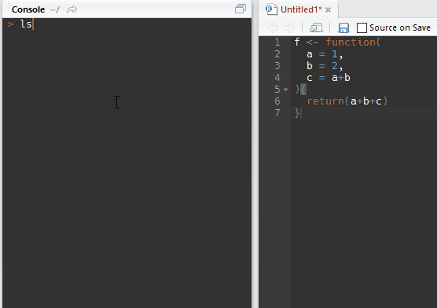

<!-- README.md is generated from README.Rmd. Please edit that file -->
[](https://travis-ci.org/petermeissner/assignparams)

**RStudio addin to evaluate function parameters via shortcut**

This addin's use case was inspired by my personal workflow but technical details and the idea to use a GIF to showcase the pacakge were shamelessly copy-cycle-pasted from [Jenny 'Queen of Spreadsheets and Mistress of De-Nerdification' Bryan's related *jadd* addin](https://github.com/jennybc/jadd).

**Installation**

``` r
devtools::install_github("petermeissner/assignparams")
```

**Showcase**


